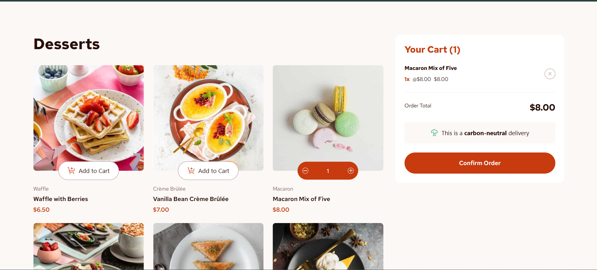

# Frontend Mentor - Product list with cart solution

This is a solution to the [Product list with cart challenge on Frontend Mentor](https://www.frontendmentor.io/challenges/product-list-with-cart-5MmqLVAp_d).

## Table of contents

- [Overview](#overview)
  - [The challenge](#the-challenge)
  - [Screenshot](#screenshot)
  - [Links](#links)
- [My process](#my-process)
  - [Built with](#built-with)
  - [What I learned](#what-i-learned)
  - [Continued development](#continued-development)
  - [AI Collaboration](#ai-collaboration)
- [Author](#author)

## Overview

### The challenge

Users should be able to:

- Add items to the cart and remove them.
- Increase/decrease the number of items in the cart.
- See an order confirmation modal when they click "Confirm Order".
- Reset their selections when they click "Start New Order".
- View the optimal layout for the interface depending on their device's screen size.
- See hover and focus states for all interactive elements on the page.

### Screenshot

### Links

[Live Site URL](https://enghalih.github.io/product-list-with-cart/)

## My process

### Built with

- Semantic HTML5 markup
- [React](https://reactjs.org/) - JS Library
- [Tailwind CSS](https://tailwindcss.com/) - For styles
- Mobile-first workflow
- React Context API - For State Management

### What I learned

This project was a significant milestone in my React journey. I learned how to effectively manage global state using the Context API to sync the product list with the shopping cart.

One technical hurdle I faced was the "Fast Refresh" warning when exporting multiple items (Context, Provider, and Hook) from a single file. I learned that to maintain optimal development performance, it's often better to keep components and logic separated, though I chose to keep the Context logic unified for this specific challenge.

I also deepened my understanding of how to use `useEffect` and `useState` to handle complex interactions like resetting a cart after an order confirmation.

### Continued development

I want to dive deeper into React performance optimization, specifically learning when to use `useMemo` or `useCallback` when passing context values down to many children to prevent unnecessary re-renders.

### AI Collaboration

For this project, I used **Windsurf** primarily for its advanced autocomplete features. This helped me speed up the process of writing Tailwind classes and repetitive JSX structures, allowing me to focus more on the core logic of the React state.

## Author

- Frontend Mentor - [@enghalih](https://www.frontendmentor.io/profile/enghalih)
- Github - [@enghalih](https://github.com/enghalih)
- Linkedin - [Wenning Ghalih](https://www.linkedin.com/in/enghalih/)
